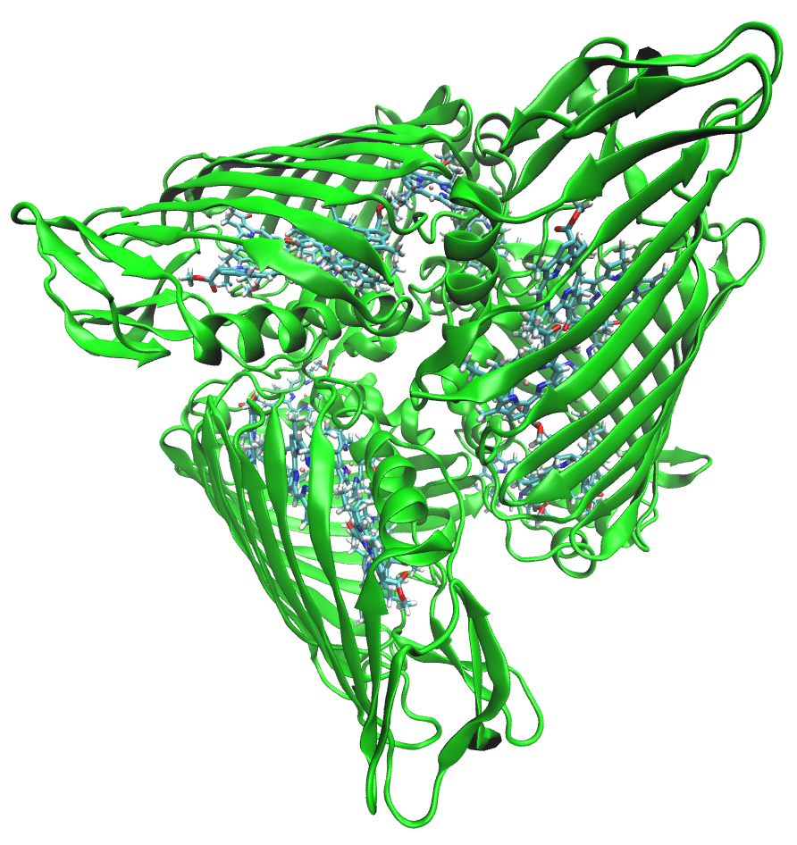

.. _FlexEFP_fmo.rst:

*************************
FMO: Applied flexible EFP
*************************

As is the case with many photoactive proteins,computational methods struggle to reproduce experimental 
spectra for the Fenna-Matthews-Olson complex (FMO). Work by `Kim et al <https://pubs.acs.org/doi/full/10.1021/acs.jpclett.9b03486>`_
shows that flexible QM/EFP can be applied to FMO to correctly generate computational results in quantitative agreement to
experimental spectra. 

The key to applying EFP to your system is to carefully define the active site and EFP region. FMO is a trimeric protein 
with eight bacteriochloropyll a (BChl) pigments in each monomer. FMO completes energy transfer via excitonic couplings
across these eight BChls. A summary of the complete workflow that was performed is the following: 
1) molecular dynamics (MD) simiulations of the FMO protein in water and counter ions, 2) QM/MM (not EFP) 
geometry optimization of *each* active site (active sites is this case are one BChl pigment and typically 
3 H-bonding amino acids), and 3) flex-EFP excited state energy calculations of each pigment.

These steps must be repeated on several snapshots from MD to account for variation in the resting state of the structure,
and the QM region must be defined carefulyl in both the QM/MM and flex-EFP stages. It might not be universally true that 
one must perform QM/MM geometry optimization, but in the case of FMO this is a necessary step.

   
.. image:: images/FMO_mon_pigs.bmp
   :width: 400

