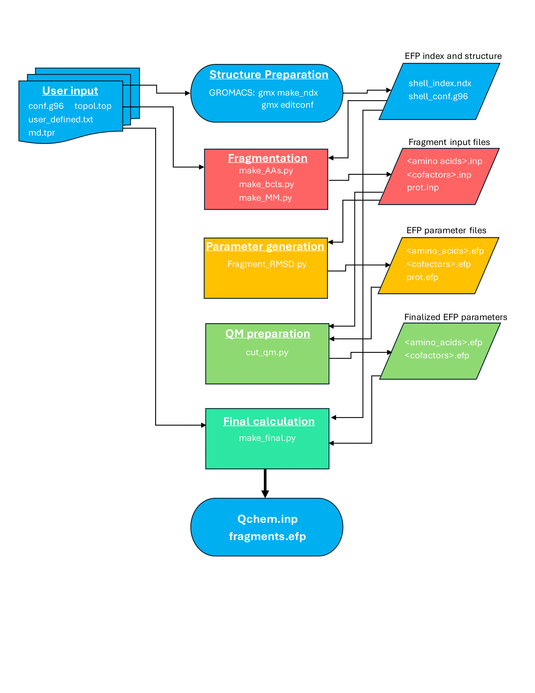
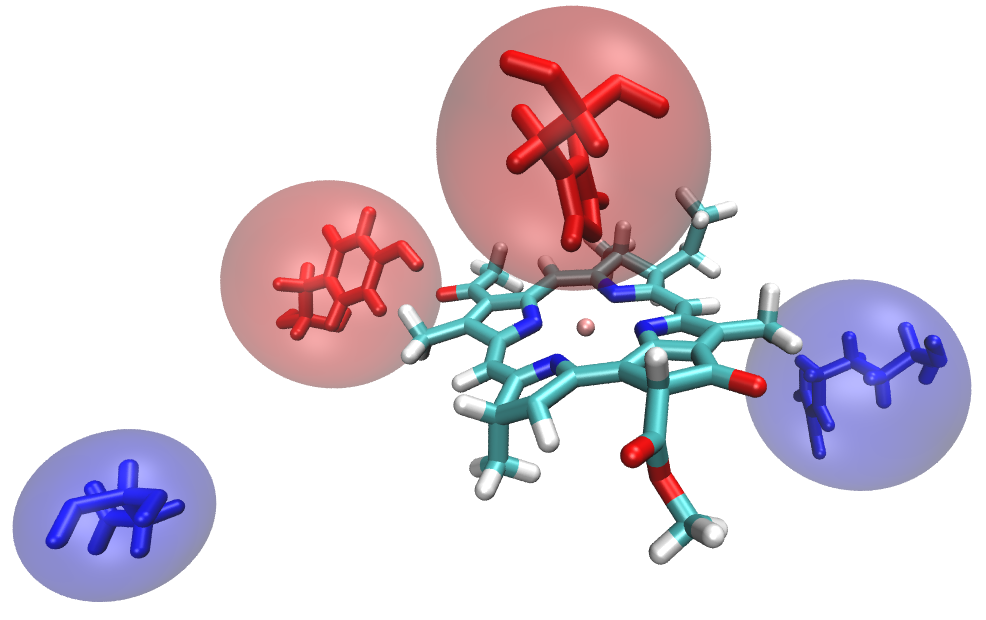

.. _applied_efp:

*************************
FMO: Applied flexible EFP
*************************

Overview
========

Computational methods struggle to reproduce experimental spectra in photoactive proteins.
One such protein is the the Fenna-Matthews-Olson complex (FMO). Work by 
`Kim et al <https://pubs.acs.org/doi/full/10.1021/acs.jpclett.9b03486>`_ shows that 
flexible QM/EFP can be applied to FMO to correctly generate computational results in 
quantitative agreement to experimental spectra. In short, the solvatochromic environments
surrounding each bacteriochloropyll a (BChl) pigment are heavily polarizable; EFP captures
this polarizability explicitly where a standard QM/MM calculation only approximates it;
thus, that the polarizable environment is crucial in modelling photosynthesis. This page 
detials how to perform flex-EFP calculations on the FMO system.  

FMO is a trimeric protein with eight bacteriochloropyll a (BChl) pigments in each monomer. 
FMO completes energy transfer via excitonic couplings across these eight BChls. In this 
example, molecular dynamics and QM geometry optimizations were performed prior to the EFP 
calculation like the one this walthrough will details.

.. image:: ../images/FMO_trimer_BCLs.bmp
   :width: 350
   :align: center
   
.. image:: ../images/FMO_mon.bmp
   :width: 400
   :align: center

The general procedure is to define the QM and EFP regions, fragment the residues in the 
EFP region, generate the starting fragment parameters, trim overlapping virtual/real atoms, 
then create the final calculation input.

You will need a structure file (.g96), a topology file (.top), and a binary input from molecular dynamics (.tpr). A structure file can be extracted 
from a GROMACS molecular dynamics trajectory. In this example, water molecules more than 15 angstroms from the protein's surface have 
been removed. For a chlorophyll-containing protein, you will likely want to optimize the geometry of each active chlorophyl 
molecule (with very close amino acids/water molecules) separately with more standard QM/MM approaches before proceeding 
with EFP calculations on the optimized geometry. For this example, the third BChl (residue number 361) has been optimized 
and will be the QM region for the EFP calcuation.

.. image:: ../images/fmo_waters15a.bmp
   :width: 400
   :align: center

Structure Preparation
=====================

First, an EFP region must be defined. Every amino acid, (non-QM) BChl, and water molecule containing an 
atom within 15 angstroms of the QM BChl headring. 

The headring is defined by the atomnames: ``MG CHA CHB HB CHC HC CHD HD NA C1A C2A H2A C3A H3A C4A CMA HMA1 HMA2 HMA3 NB C1B C2B C3B C4B CMB HMB1 HMB2 HMB3 CAB OBB CBB HBB1 HBB2 HBB3 NC C1C C2C H2C C3C H3C C4C CMC HMC1 HMC2 HMC3 CAC HAC1 HAC2 CBC HBC1 HBC2 HBC3 ND C1D C2D C3D C4D CMD HMD1 HMD2 HMD3 CAD OBD CBD HBD CGD O1D O2D CED HED1 HED2 HED3``

The headring surrounded by the EFP region looks like this:

.. image:: ../images/tester.bmp
   :width: 400
   :align: center
   
As you can see, the solvatochromic environment of each BChl is an overwhelming ensemble. The mission of EFP is to break this 
complex environment into each contributing "fragment." Then, those fragments can be analyzed by individual contribution. 
The final calculation allows us to look at a focused version of the environment like the image below:

Each fragment induces a shift to the BChl excited state energy. Pairwise excitation energy decomposition reveals the magnitude and 
direction (ie, blue or red shift) that each fragment induces to a given BChl molecule. Thus, EFP can offer deeper insight into the 
solvatochromic control over the protein's optical spectra.

Extract a single snapshot of MD extracted from GROMACS ie: ``gmx traj -f md_50.trr -s md_50.tpr -o bchl361-79002.g96``\(.g6 format).
Please note that extracting larger systems can occasionally cause columns to be misaligned due to the residue ID number passing from 9999 to 10000. 
This misalignemnt can make the structure appear strangely in VMD or other visualizers (ie, you will see "sheets" of waters with coordinates
read incorrectly). Though it shouldn't matter, you can fix the problem by realigning the columns. 
`Here <../examples/flex-EFP/Scripts/format.py>`_ is an example of a script that can do this with an output file of ``formed_bchl361-79002.g96``.

Now, we need to know which amino acids, cofactors, and water molecules constitute the EFP region. One method to find this is to
make use of the ``gmx select`` command, but this will take a bit of footwork. You will need to create an index file 
that defines the BChl head ring group for reference in gmx selections. The code below will generate this index file with the default 
name ``index.ndx``; index.ndx contains all standard GROMACS index groups (system, protein, etc), with one final nonstandard group, 'headring'.

.. literalinclude:: ../examples/flex-EFP/Scripts/gen_efp_index.sh
   :linenos:
   
Here is a visualization of atoms contained in the newly created index group:

.. image:: ../images/361_headring.bmp
   :width: 400
   :align: center

Note: the QM region will include the entire BChl, but the EFP region will be defined by distance to this ring group 
only.

The EFP region should be composed of all residues that contain at least one atom within 15 angstoms of the headring. 
A new .g96 can be made using the command: ``gmx select -s md_80.tpr -n index.ndx -f bchl361-79002.g96 -select 
'same residue as within 1.5 of group "Headring"' -on shell_index.ndx``. 
This looks for any atom within our cutoff (1.5 because GROMACS standard units are nm), then accepts every atom belonging to 
the same residue as the found atom and adds these to the selection. The output of the command is named shell_index.ndx, which as the 
extension implies, is another index file. This file has exactly one index group that is the EFP region. 

Now, ``gmx editconf -f formed_bchl361-79002.g96 -n shell_index.ndx -o shell_bchl361-79002.g96`` creates a new structure 
file of the EFP region only. Note that you do not need to specify group output because the .ndx file only contains one group. 
The structure should look like the 'desired EFP region' shared above on this page (in the Overview section).

The following scripts require a user-defined text file that lists which atoms will be included in the QM region, and 
any pair of atoms that form a covalent bond across the division of the QM and MM regions. The QM region for this structure will 
of course include atoms from the BCL residue 361, but we will also include atoms from the nearby histidine that coordinates the 
BCL magnesium atom shown below.

.. image:: ../images/qm_region.bmp
   :width: 400
   :align: center

This shows the entire residue 361 (BCL) and 290 (HIS), however, we only want to include the side chain of this histidine. 
In other words, atoms that extend down the side chain after the alpha-carbon should be included in the QM region, and the 
backbone atoms should remain in the EFP region. That division looks like this:

.. image:: ../images/qm_w_cut.bmp
   :width: 400
   :align: center

This is a tricky problem. To generate the fragment parameters, we will need an input file with every atom in the 
amino acid. After we have obtained an efp file with the full fragment's parameters, the QM atoms will be stripped out.
Now, this creates a second issue. The QM region must be capped with a virtual hydrogen, so the result looks like this:

.. image:: ../images/qm_capped.bmp
   :width: 400
   :align: center

There will be a virtual hydrogen resting in roughly the same position as the the alpha-carbon (that is in the EFP region, NOT 
the QM region). When the efp parameter file for residue 290 is created later, the QM atoms and the alpha-carbon will be stripped, 
and the EFP atoms bound to the alpha-carbon will have their multipoles and polarization points removed. The following scripts need 
some information from the user to correctly handle deleting these overlapping atoms. Specifically, the user should create a text 
file listing every atom to be included in the QM region, and a list of every pair of atoms that form a covalent bond in which one 
atom is in the QM region and the other is in the EFP(MM) region. The format should be the same as the g96 file; ie, copy and paste 
the lines of your atoms from the structure file directly. The result should look like `this example. <../examples/flex-EFP/Scripts/user_defined.txt>`_

Please note that the boundaries must have the QM atom listed first. This example contains only one QM-MM boundary, but a 
second could be included like this:

.. literalinclude:: ../examples/flex-EFP/Scripts/new_sample.txt
   :linenos:

Fragmentation
=============

The protein residues within the 15 angstrom cutoff will be expressed individually. Because amino acids are a continuous chain, 
covalent bonds between neighboring amino acids have to be broken. Chemically, we would like to break the C-C backbone bond 
(between alpha carbon and carbonyl carbon), however, standard PDB convention divides residues by the C-N bond (alpha carbon-nitrogen). 
To change this, 'C' and 'O' atom names are included in the following amino acid. This way the 'C' and 'CA' (carbonyl carbon and alpha 
carbon respectively) bond is the division between bonded fragments. See the visualizations below.

PDB residues are divided like this:

.. image:: ../images/pdb_67_col.bmp
   :width: 400
   :align: center

For EFP, we would rather these two fragments look like this:

.. image:: ../images/efp_67_col.bmp
   :width: 400
   :align: center

The atom coordinates are contained in the structure file, but they do not completely 'agree' with the amino 
acid numbering. Below is a snippet from the structure file (.g96) with the EFP fragment 8 highlighted. Note that atom 
names 'C' and 'O' are included in the following fragment (fragment 9).

.. literalinclude:: ../examples/flex-EFP/1.Prepare_Structure/bchl361-79002.g96
   :linenos:
   :lines: 79-101
   :emphasize-lines: 10-21

The script ``make_AAs.py`` accomplishes this. A sample execution is: 

``python make_AAs.py shell_bchl361-79002.g96 bchl361-79002.g96 user_defined.txt topol.top``

This script creates an input file for each fragment in the EFP region. The names take information from the fragment; 
For example, v_22_301.inp is a valine residue (v), residue number 22, and the first atom of this fragment has an atom
ID of 301. Histidine residues are denoted hd_, he, or hp_ depending on protonation states, and non-standard amino acids 
are listed as the same residue name given in the g96 structure file (ie, bcl_360_5667.inp for the BCL with residue number 360). 
Virtual hydrogens are added automatically to amino acid fragments with an atom name H000. Non amino acids fragments are created 
with no capping hydrogen by default. If a fragment contains QM atoms, those QM atom names will be added to the comment at the end 
of the input file. See below the input file for histidine residue number 290 (hd_290_4417.inp):

.. literalinclude:: ../examples/flex-EFP/1.Prepare_Structure/hd_290_4417.inp
   :linenos:
   :emphasize-lines: 31,32

Note that CA is the alpha-carbon, and is not a QM atom. However, CA is bound to a QM atom, and will be removed from the 
parameter file in a later step. If a residue contains only QM atoms, no input file will be created (no bcl_361_.inp file 
in this case). These commented lines will be used later to finalize the fragment parameter files.

Non-Amino Acids and Cofactors
-----------------------------

The previous script is good for a fragmentation scheme that includes amino acids and full molecules. The BChl fragments 
struggle to converge as whole fragments, so we will split them into two sub-fragments, called the head and tail fragments. 
Note that make_AAs.py creates fragments for the Bchls, but it creates one fragment for the entire residue, and these will 
not be used in the final calculation of this example (If you plan to create sub-fragments, you should delete the full 
molecule input files made from make_AA.py). Below is the division of the head and tail groups:

.. image:: ../images/efp_headtail.bmp
   :width: 400
   :align: center

The script ``make_bchls.py`` creates two fragment input files for each Bchl molecule according to that division. Virtual 
hydrogens are added where the two are normally covalently bound, much like the case for the amino acid backbone bonds. The 
script can be executed by: 

``python make_bchls.py shell_bchl361-79002.g96 361``

This script is somewhat "hard-coded" for the FMO BChls. Generally, cofactors should not need to be split into multiple fragments,
but chlorophyll molecules can be troublesome. If you need to split a group like this, you can edit the make_bchls.py script. Variable 
"RESNAME" is the name of the residue to be fragmented. The list "Headrings" includes the atom names for every atom to be added to the 
head fragment. Atoms that are not in this list will be added to the tail fragment. Variables "headside" and "tailside" are the names 
of the two atoms that are normally covalently bound, but will be capped for the fragmentation. Variable "site" is optional, it lists the 
residue ID of a QM residue that doesn't need to be fragmented because it is in the QM region.

Parameter Generation
====================

EFP input files are now generated and the parameters can be calculated. To avoid computing every fragment 
file directly, each fragment is compared to a database of pre-computed parameters of the same amino acid. If 
the RMSD between the two structures is sufficiently small, then the parameters are good enough for the initial 
representation of the fragment (and you don't have to calculate them!). The script `fragment_RMSD.py` can be run 
by the following example:

``fragment_RMSD.py a_4_45.inp``

This reads the given file (a_4_45.inp) and computes the RMSD with each .efp file it can find in the 
given directory. For example, the path to the .efp database in this tutorial is given as variable "base_directory",
``/depot/lslipche/data/yb_boss/flexible_efp/efpdb/``. The script searches that directory for folders of amino acid 
fragments based on the first letter of the input file. In this case, the script looks for a folder named ``ala/`` 
because the fragment input is a_4_45.inp. In other words, if you use this script, you should replace the "base_directory" 
variable with your path, then name the final folder(s) by amino acid (ie, ala/, cys/, thr/, etc). 
The desired RMSD cutoff (minimum to be considered a good match) is listed at the start of the file and can be adjusted. 

If no suitable match is found in the database, it will print a message of "No match, run GAMESS for: <filename>", 
and an .efp file will not be created. If you need to repeat this step, delete this text file to avoid confusion. 
The simplest way to use this script for you entire EFP region is to make a bash script to iterate through every *.inp 
file and execute fragment_RMSD.py *.inp. Note that if no database folder is found, or if the input is not a standard, 
non-terminal amino acid, then the python script will return an error. These special cases will need to be computed.

The Classical Region Fragment
-----------------------------

The EFP parameter files are finished. Now, a new fragment will be created with the remaining classical atoms. That 
is, every atom that is not in the QM or EFP regions. ``make_mm.py`` reads the EFP region structure, the full 
structure, and the topology to create an efp parameter file. This classical region "super" fragment is like a normal parameter 
file, but it only contains coordinates, monopoles, and screen sections; it has zeroes filled for dipole, quadrupole, octupole, 
and polarizable point sections.

``python make_MM.py shell_bchl361-79002.g96 bchl361-79002.g96 topol.top``

The topology file is necessary for atomic charges, and both structure files are read so that only MM atoms will be 
included (both QM and EFP atoms are omitted).

QM Preparation
==============

Some of the fragment parameter files contain atoms that are also in the QM region. Additionally, when a QM virtual 
hydrogen is added to replace the bond of an EFP atom, that EFP atom is overlapped with the virtual hydrogen. The
overlapping EFP atom should be removed to avoid sporatic effects. EFP atoms that are bound to the removed atom will 
also have their multipoles and polarization points removed. The coordinates, monopoles, and dampening (screen) 
terms are retained. 

A sample execution is:

``cut_qm.py hd_290_4417.inp hd_290_4417.efp``

ala_33_473.inp is an alanine fragment with QM atoms commented to be deleted and EFP atoms to have polarization 
points removed. a0001.efp is a parameter file that is either the output of the input file, or translated 
information from a database parameter file to align with the input's coordinates. cu_qm.py must be executed on every 
fragment. Note, virutal hydrogens named H000 will always be removed even though they do not appear in the comments.

Final Input Generation
======================

Now that all fragment .efp files are made and finallized, the final Qchem input file can be created. ``make_final.py` is 
the appropriately named file for this, sample execution looks like:

``make_final.py shell_bchl361-79002.g96 bchl361-79002.g96 user_defined.txt``

Function "make_header" contains the keywords for the Qchem calculation; these can be adjusted as needed. When you submit 
the calculation, .efp parameter files will need to be in the same folder as the input file. 

Time-Saving Tips
================

In the case of FMO, the normal procedure is to repeat the EFP calculation for eight different BChl pigments. Fragments 
can be reused between calculations if they come from the same snapshot. ie, bchl360-79002.g96 will need a handful of new 
fragments than those created already for bchl361-79002, but the majority of EFP fragments are already made. This can save 
a lot of time in repeated calculations.