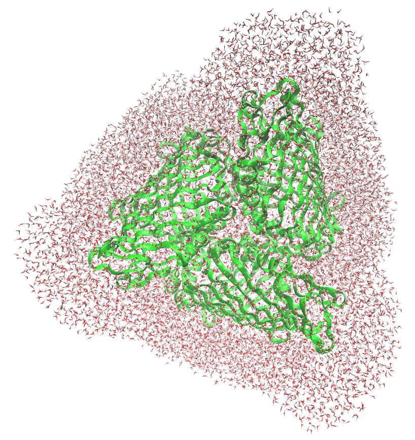
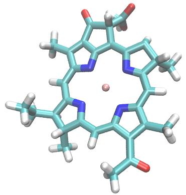
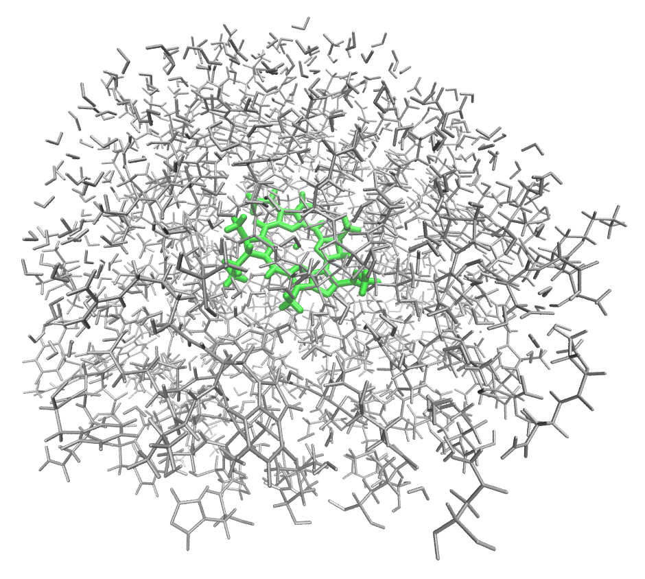
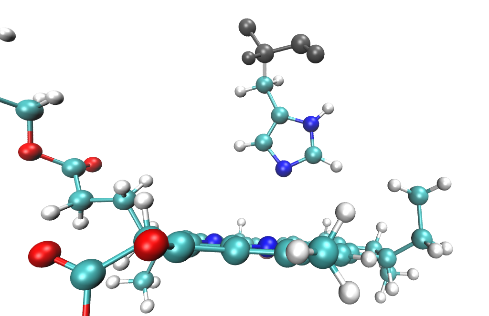
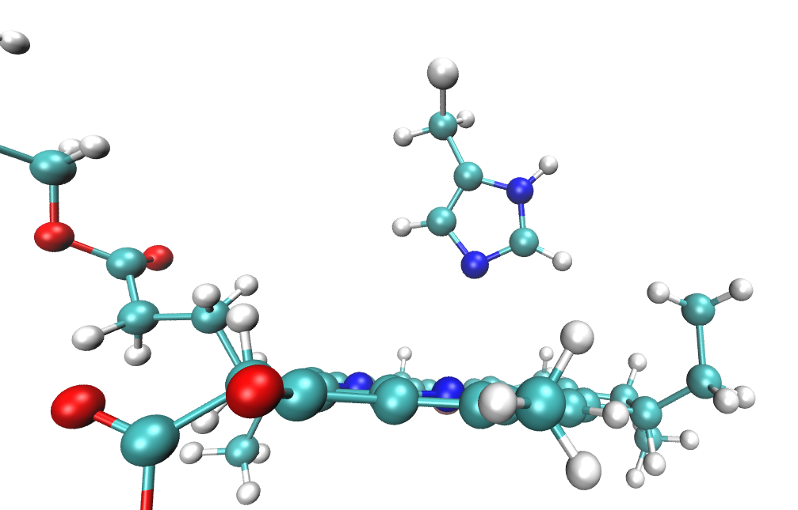
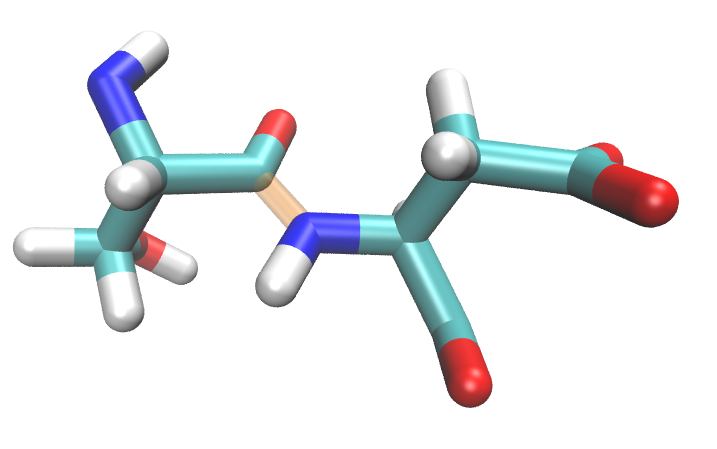
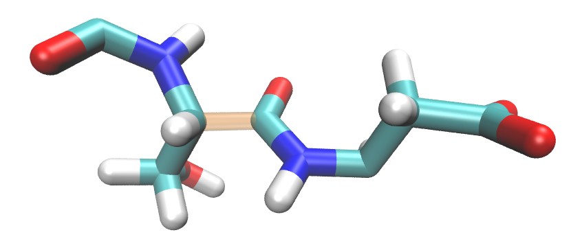
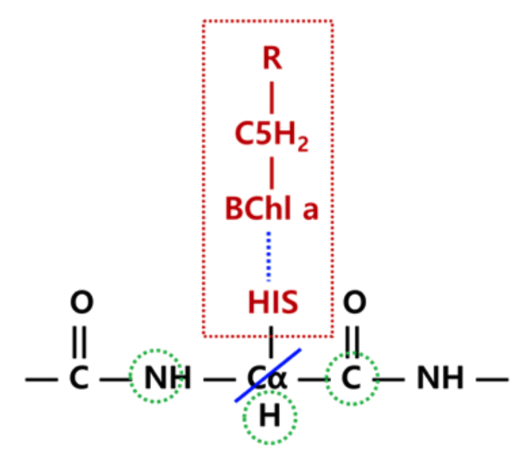
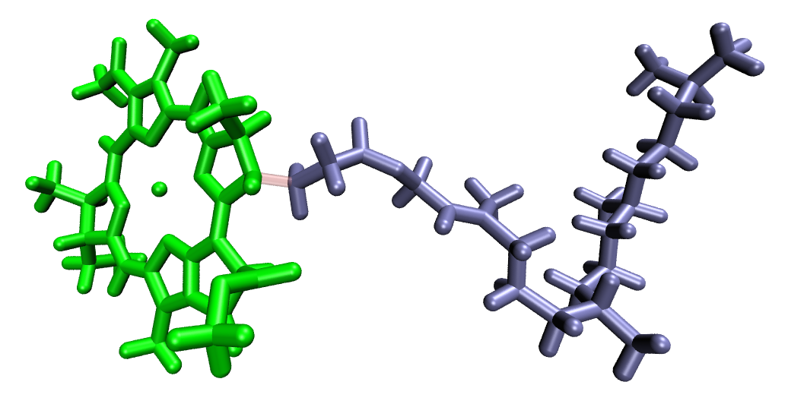

.. _applied_efp:

*********************************************
QM/EFP calculations using BioEFP and FlexEFP
*********************************************

Introduction
============

QM/EFP methods are powerful tools for describing photo- and redox-chemistry in condensed phases,
see e.g., :ref:`bio_papers`. However, setting up QM/EFP calculations for complex systems is
not trivial and time-consuming. This tutorial presents a computational workflow that helps
interested users to set up QM/EFP calculations of photoactive proteins in a format suitable for
calculations in Q-Chem. It is assumed that the initial structures for QM/EFP calculations are
obtained from a GROMACS MD trajectory. GAMESS is used for computing EFP parameters.

The workflow was tested on several photosynthetic pigment-protein complexes (FMO, PS1, WSCP).
While the workflow is reasonably general and can be adapted to other biological and materials
systems, the QM/EFP calculations are not black-box procedures and the user will need to make
decisions based on the system specifics and the properties of interest. 

The following scripts are covered in this tutorial:

* ``make_AAs.py`` — prepares GAMESS MAKEFP input files for all EFP region fragments
* ``cut_caps.py`` — trims EFP parameter files by removing capping hydrogens and correcting charges
* ``make_qchem_input.py`` — assembles the final Q-Chem QM/EFP input file

Preliminaries
=============

The following software is required:

* GROMACS
* GAMESS
* Q-Chem
* libEFP
* Python 3 (with numpy)

To start with, you will need the following GROMACS files:

* structure file (``.g96``)
* topology file (``.top``)
* binary run input file (``.tpr``)

If you wish to use the FlexEFP scheme as described in `Flexible EFP paper
<https://pubs.acs.org/doi/abs/10.1021/acs.jpcb.6b04166>`_, you also need
a library of precomputed EFP potentials. The parameter database from the `Flexible EFP paper
<https://pubs.acs.org/doi/abs/10.1021/acs.jpcb.6b04166>`_ can be found
`here <https://github.com/libefp2/EFP_parameters/tree/main/AA_flexible_efp>`_.

Workflow overview
=================

.. image:: ../images/flowchart.pdf
   :width: 500
   :align: center

The workflow leads the user through the following steps:

* :ref:`setup_QM_EFP`
* :ref:`fragmentation`
* :ref:`parameter_making`
* :ref:`trim_params`
* :ref:`qchem_input`

FMO protein
===========

The Fenna-Matthews-Olson (FMO) protein is used as an example system throughout this tutorial.
Preparation of the QM and EFP regions follows the work by
`Kim et al. <https://pubs.acs.org/doi/full/10.1021/acs.jpclett.9b03486>`_.

FMO is a trimeric protein with eight bacteriochlorophyll a (BChl) pigments in each monomer.
FMO facilitates energy transfer via excitonic couplings across these eight BChls.

.. image:: ../images/FMO_trimer_BCLs.bmp
   :width: 350
   :align: center

.. image:: ../images/FMO_mon.bmp
   :width: 400
   :align: center

In the present example, water molecules more than 15 Angstroms from the protein surface have been
removed.

Molecular dynamics and constrained QM/MM geometry optimizations have been performed on the
system prior to this tutorial. Constrained QM/MM geometry optimizations have been shown to be
essential for accurate predictions of optical spectra and redox properties. However, this step
is not covered here and it is left to the user to perform if needed.

.. note:: The provided .g96 file contains ``QSL`` and ``LA`` residues, corresponding to
   "quantum" waters (water molecules included in the QM region during QM/MM optimizations)
   and link atoms that were utilized in QM/MM optimizations, respectively. These are left 
   over from the QM/MM optimization step and are not required for any of the scripts in this tutorial.
   
.. _setup_QM_EFP:

Defining QM and EFP regions
===========================

In the present example, the QM/EFP calculation will be set up for the third BChl (residue number 361) 
in the active (QM) region.

.. _efp_region:

EFP region
----------

While it is possible to include all non-QM atoms in the EFP region, this approach can be
computationally expensive for larger proteins for computing EFP parameters
and performing QM/EFP calculations. A practical approach is to define an EFP region that
includes all residues within a particular distance from the QM region. Here, we include every
amino acid, non-QM BChl, and water molecule containing at least one atom within 15 Angstroms
of the BChl chlorin ring.

.. note:: A single snapshot can be extracted from a GROMACS MD trajectory in .g96 format using:

   ``gmx trjconv -s md_50.tpr -f md_50.trr -o snapshot_50000.g96 -dump 50000``

.. note:: Extracting larger systems can occasionally cause columns to be misaligned when the
   residue ID passes from 9999 to 10000. This misalignment can make the structure appear
   incorrectly in VMD or other visualizers (e.g., "sheets" of waters with misread coordinates).
   Though it shouldn't matter for this tutorial, you can fix the problem by realigning the columns. 
  `Column reformatting script <../examples/flex-EFP/Scripts/format.py>`_ is an example of a
  script that can fix this problem.

To determine which residues constitute the EFP region, we use the ``gmx select``
command. First, create an index file defining the BChl ``headring`` group containing the
atoms of the chlorin ring:

.. note:: The BChl chlorin ring (``headring``) is defined by the following atom names:
  ``MG CHA CHB HB CHC HC CHD HD NA C1A C2A H2A C3A H3A
  C4A CMA HMA1 HMA2 HMA3 NB C1B C2B C3B C4B CMB HMB1 HMB2 HMB3 CAB OBB CBB HBB1 HBB2 HBB3 NC C1C
  C2C H2C C3C H3C C4C CMC HMC1 HMC2 HMC3 CAC HAC1 HAC2 CBC HBC1 HBC2 HBC3 ND C1D C2D C3D C4D CMD
  HMD1 HMD2 HMD3 CAD OBD CBD HBD CGD O1D O2D CED HED1 HED2 HED3``

The following code generates the index file (``index.ndx``) containing all standard GROMACS
index groups with the new ``headring`` group appended:

.. literalinclude:: ../examples/flex-EFP/Scripts/gen_efp_index.sh
   :linenos:

.. warning:: Make sure to adjust the code above to your system's active region!

Here is a visualization of the atoms contained in the newly created index group:

The following command selects all residues containing at least one atom within 1.5 nm
(15 Angstroms) of the ``headring`` group and writes them to a new index file:

``gmx select -s md_80.tpr -n index.ndx -f bchl361-79002.g96 -select
'same residue as within 1.5 of group "Headring"' -on shell_index.ndx`` 

The output ``shell_index.ndx`` contains exactly one index group defining the EFP region.
Next, extract the EFP region into a new structure file:

``gmx editconf -f formed_bchl361-79002.g96 -n shell_index.ndx -o shell_bchl361-79002.g96``

Note that no output group needs to be specified since ``shell_index.ndx`` contains only one
group. The resulting EFP shell surrounding the headring looks like this:

.. note:: The QM region will include the entire BChl, but the EFP region is defined by distance to the chlorin ring only.

QM region
---------

.. warning:: Defining the QM region is system-specific. The user must prepare a text file
   containing all atoms of the QM region as well as pairs of atoms defining any covalent
   boundaries between the QM and EFP regions.

An example file prepared for the third BChl in FMO is provided:
:download:`qm_defined.txt <../examples/flex-EFP/Scripts/qm_defined.txt>`. This file can be
constructed by copying the corresponding lines from the ``.g96`` file. The ``QM_atoms``
section should contain all QM atoms, not including capping hydrogens for covalent QM-EFP
boundaries.

.. literalinclude:: ../examples/flex-EFP/Scripts/qm_defined.txt
   :linenos:
   :lines: 1-20
   :append: ...
   :emphasize-lines: 1

The "QM-MM" boundary section is optional and should contain pairs of atoms for each 
covalent boundary, with the QM atom listed first. The example
 :download:`qm_defined.txt <../examples/flex-EFP/Scripts/qm_defined.txt>` 
 contains only one QM-MM boundary, but a second boundary could be included like this:

.. literalinclude:: ../examples/flex-EFP/Scripts/new_sample.txt
  :linenos:
  :lines: 1-
  :emphasize-lines: 1

Note that the atom indexes MUST match those in the structure file, but the coordinates 
do NOT need to match. If you are planning to run multiple EFP calculations on identically-built
structures (e.g. different times of a single MD trajectory), then you can reuse the same 
QM-defining text file.

.. _qm_region_bchl:

Example: QM region for the third BChl in FMO
~~~~~~~~~~~~~~~~~~~~~~~~~~~~~~~~~~~~~~~~~~~~

By trial and error we found that including the Mg-coordinating amino acid residue in the QM region
in QM/EFP calculations helps SCF convergence and makes excitation energies more reliable.
Thus, the QM region will include all atoms of the BChl (residue BCL 361) as well as atoms from the nearby
histidine that coordinates the BChl Mg atom shown below.

.. image:: ../images/qm_region.bmp
   :width: 400
   :align: center

The full residues 361 (BCL) and 290 (HIS) are shown above; however, only the side chain of
the histidine is included in the QM region. Specifically, residue atoms from :math:`C_{\beta}`
onward are included, while backbone atoms from :math:`C_{\alpha}` onward remain in the EFP
region:

A covalent QM-EFP boundary is therefore defined between :math:`C_{\beta}` and
:math:`C_{\alpha}`. The scripts automatically cap the QM region with hydrogen atoms positioned
along the boundary bond, so the QM region in the QM/EFP calculation looks like this:

Preparation of the EFP fragment for the boundary histidine is discussed in
:ref:`qmefp_boundary_fragments`.

.. _fragmentation:

Fragmentation of the EFP region
===============================

Now we need to prepare EFP fragments for our system. In :ref:`efp_region` we have already
created a ``.g96`` file containing atoms belonging to the EFP region. Here we will split
polypeptide chains and other large residues into EFP fragments.

.. _protein_efp:

Splitting protein into EFP fragments
------------------------------------

Because proteins tend to be continuous chains, covalent bonds between neighboring amino acids 
have to be broken for fragmentation. Chemically, the :math:`C-C_{\alpha}` bond (between alpha 
carbon and carbonyl carbon) is broken, however, standard PDB convention divides residues by the 
C-N bond (alpha carbon-nitrogen).

Visually, PDB residues are divided like this:

but EFP fragments should be divided like this:

Therefore, EFP amino acid fragments will not completely agree with PDB amino acid numbering.
Below is a snippet from the structure file (``.g96``) with EFP fragment 7 highlighted. Note
that atoms ``C`` and ``O`` of PDB residue 6 (SER) are included in EFP fragment 7 (ASP).

.. literalinclude:: ../examples/flex-EFP/1.Prepare_Structure/bchl361-79002.g96
   :linenos:
   :lines: 79-101
   :emphasize-lines: 10-21

A daunting task of splitting the protein into EFP fragments is accomplished by script ``make_AAs.py``.
A sample execution is:

``python make_AAs.py shell_bchl361-79002.g96 bchl361-79002.g96 qm_defined.txt topol.top <timestep> <mutant>``

* ``.g96`` file containing atoms of the EFP region (see :ref:`efp_region`)
* ``.g96`` file containing the full system (initial structure from MD)
* user-prepared file defining the QM region and QM-EFP boundaries (see :ref:`setup_QM_EFP`)
* topology file (``topol.top``)
* timestamp to differentiate output files (e.g. ``50000``)
* mutant label (e.g. ``wt``)

Output:

* GAMESS MAKEFP input files for all amino acid and other residues in the EFP region

.. note:: GAMESS MAKEFP input file parameters (basis set, memory, etc.) can be adjusted
   directly in ``make_AAs.py``.

The script splits the EFP region into fragments and creates a GAMESS MAKEFP input file for
each. Output filenames are derived from the full system ``.g96`` file. For example,
``v_22_301_50000_wt.inp`` corresponds to a valine residue (``v``), residue number 22, with
first atom ID 301 (of the full structure, NOT the structure of the EFP region). Histidine residues
are denoted ``hd_``, ``he_``, or ``hp_`` depending on protonation state. Capping hydrogens
are added automatically to amino acid fragments, they will always have the atom name ``H000`` 
(multiple virtual hydrogens will have the same atom name). These will be removed from the EFP 
parameter files in a later step (see :ref:`trim_params`).

Non-standard residues and cofactors are named using the full residue name from the ``.g96``
file (e.g., ``bcl_360_5667_50000_wt.inp`` for BCL with residue number 360). Non-amino acid
fragments are created without capping hydrogens by default. 

.. _qmefp_boundary_fragments:

QM-EFP boundary fragments
--------------------------

For a fragment with a covalent QM-EFP boundary (e.g., HIS 290 from :ref:`qm_region_bchl`),
``make_AAs.py`` will append two comment lines to the end of the input file. The
``!erased:`` line lists atom names of QM atoms to be removed from the parameter file.
The ``!remove:`` line additionally lists atoms around which polarization points will be
removed, identified by analysis of the topology file. Here is an example for HIS 290
(``hd_290_4417_50000_wt.inp``):

.. literalinclude:: ../examples/flex-EFP/1.Prepare_Structure/hd_290_4417_50000_wt.inp
   :linenos:
   :emphasize-lines: 31,32

Note that while :math:`C_{\alpha}` is not part of the QM region, it is a QM-EFP boundary
atom and will also be removed from the parameter file in a later step. These comment lines
are used by ``cut_caps.py`` to finalize the fragment parameter files (see :ref:`trim_params`).
The boundary scheme follows the approach developed by
`Kim et al. <https://pubs.acs.org/doi/full/10.1021/acs.jpclett.9b03486>`_, which ensures
stability of QM/EFP calculations in the FMO protein.

.. warning:: The QM-EFP boundary scheme for amino acid fragments is general. However,
   the user may need to modify it for non-standard fragments.

If a residue contains only QM atoms, such as BCL 361 in our example, no input file
will be created.

Non-amino acids and cofactors
-----------------------------

``make_AAs.py`` handles EFP fragment preparation for standard amino acid sequences,
non-covalently linked molecules (e.g., water molecules, ions), and cofactors including
(B)Chls. For large cofactors exceeding roughly 100 atoms, the script creates one fragment
for the entire residue by default. Sometimes, it is desirable to split a large cofactor into 
sub-fragments. See below, the separate chlorin head and phytol tail fragments for a BCL. 

Below is an example of the head/tail division used for BChl:

For the BChl case, capping hydrogens are added at the head-tail junction in the same way as
for amino acid backbone cuts. CLA, BCL, LMG, and LHG fragments are cut using this script, but 
note that atom names must match those used in this example setup. The same syntax used for those 
can be used to create a custom sub-fragmentation scheme. The relevant variables to adjust are 
contained the ``define_ligand_cut`` function, and they are:

* ``RESNAME`` — residue name to be fragmented
* ``Rings`` — list of atom names to include in the head fragment; all others go to the tail
* ``headside`` / ``tailside`` — atom names on either side of the covalent cut
* ``site`` — optional; residue ID of a QM BChl that should be skipped entirely

.. _parameter_making:

EFP parameter generation
========================

``make_AAs.py`` from the previous step created a collection of GAMESS MAKEFP input files.
You now have two options for obtaining EFP parameters:

* Compute all needed EFP parameters by running the MAKEFP inputs in GAMESS
* Use the FlexEFP procedure to obtain parameters by rotation of precomputed parameters
  stored in a database

If your system is small or you do not wish to use the FlexEFP scheme, submit GAMESS
calculations for all generated inputs, collect all produced ``.efp`` files, and proceed
to :ref:`trim_params`.

Otherwise, ``frag_RMSD_V2.py`` checks the geometry of each fragment against fragments
available in the precomputed parameter database. For amino acids, the script searches only
among fragments of the same amino acid type. If the RMSD between the two structures is
below the threshold, the database parameters are considered 
transferable and will be rotated and translated to match the geometry of your 
fragment— no GAMESS calculation needed for that fragment. Note that if the RMSD is greater
than the cutoff threshold, you will need to generate the parameters of that fragment in 
GAMESS. You can add computed parameters to your fragment library to reduce the computation
time of future timesteps.

.. note:: The path to the EFP parameter database is hardcoded in ``frag_RMSD_V2.py``.
   Adjust it to point to your local copy of the database before running.

.. note:: The RMSD threshold is hardcoded in ``frag_RMSD_V2.py`` to 0.2 Angstroms.
   Adjust if desired.

The script is run on one single GAMESS MAKEFP input file at a time:

``frag_RMSD_V2.py a_4_45_50000_wt.inp``

This reads ``a_4_45_50000_wt.inp`` (an alanine fragment, identified by the ``a_`` prefix) and
computes the RMSD against each ``.efp`` file found in the ``ala/`` subdirectory of the
database. The database subdirectory is determined automatically from the one-letter amino
acid prefix in the filename (e.g., ``a`` → ``ala/``, ``v`` → ``val/``, etc.).

If no suitable match is found, the script prints:

``No match, run GAMESS for: <filename>``

and no ``.efp`` file is created for that fragment. If no database folder is found, or if
the input is not a standard non-terminal amino acid, the script will return an error. All
such fragments will need to be computed in GAMESS. Fortunately, most of these calculations
will not take more than a few minutes.

A simple way to run ``frag_RMSD_V2.py`` on all fragments at once is to iterate over every
``*.inp`` file in the current directory using a bash script:

.. code-block:: bash

   for f in *.inp; do
       python frag_RMSD_V2.py $f
   done

After running, any fragment for which no ``.efp`` file was produced will need to be
submitted to GAMESS. A convenient way to identify these is:

.. code-block:: bash

   for f in *.inp; do
       base="${f%.inp}"
       if [ ! -f "${base}.efp" ]; then
           echo "No EFP found, submit to GAMESS: $f"
       fi
   done

.. _clasical_fragment:

The Classical Region Fragment
-----------------------------

Atoms not included in either the QM or EFP regions — i.e., atoms far from the QM subsystem
— are treated as classical atoms possessing only partial charges. These are combined into a
single EFP "superfragment" containing only coordinates, monopoles, and screen sections.

``make_AAs.py`` will create this, and it should not require any more preparation other than 
the structure files already provided.

The topology file provides atomic charges. Both structure files are required so that only
classical atoms are included — QM and EFP atoms are automatically omitted.

.. _trim_params:

EFP parameter trimming
=======================

Before using the EFP parameters in QM/EFP calculations, the fragment parameter files must
be trimmed. Specifically:

* Capping hydrogens added to amino acid fragments to make them closed-shell molecules for
  parameter calculations must be removed, along with all associated parameters.
* Fragments with covalent QM-EFP boundaries must be cleaned of all QM atoms and boundary
  atoms. Additionally, polarization points near the boundary must be removed to avoid
  overpolarization of the QM region.
* Sub-fragmented molecules are treated in the same way as amino acid fragments — capping 
  hydrogens at the head-tail junction are removed automatically.

This trimming is handled by ``cut_caps.py``. The script uses the comment lines appended by
``make_AAs.py`` (see :ref:`qmefp_boundary_fragments`) to determine which atoms and
polarization points to remove.

.. note:: ``cut_caps.py`` will always remove hydrogens named ``H000`` (capping hydrogens
   added to cap dangling bonds when fragments were cut from a larger molecule) and all
   associated parameters, regardless of the comment lines in the input file.

QM-EFP boundary fragments are treated based on the ``!erased:`` and ``!remove:`` comment
lines in the input file, as described in :ref:`qmefp_boundary_fragments`.

``cut_caps.py`` operates in two modes: ``check`` (default) and ``fix``.

In ``check`` mode, the script validates the EFP parameter file for completeness and
sanity without modifying it:

* Exits with an error if the ``.efp`` file is incomplete (missing ``$end`` statement)
* Exits with an error if the fragment charge is non-integer or if partial charges
  exceed the ``charge_cutoff`` threshold
* Prints a warning if large polarizability values are found

In ``fix`` mode, the script performs the trimming and writes the result to
``cut_<efp_filename>``.

.. note:: Check and adjust the ``charge_cutoff`` and ``polab_cutoff`` settings at the
   top of ``cut_caps.py`` if needed for your system.

A sample execution in ``check`` mode:

``python cut_caps.py hd_290_4417_50000_wt.inp hd_290_4417_50000_wt.efp``

A sample execution in ``fix`` mode:

``python cut_caps.py hd_290_4417_50000_wt.inp hd_290_4417_50000_wt.efp fix``

The two arguments are:

* GAMESS MAKEFP input file (``.inp``) — provides the atom removal instructions via
  comment lines
* EFP parameter file (``.efp``) — either the direct output of the GAMESS MAKEFP
  calculation, or a parameter file rotated and translated by ``frag_RMSD_V2.py``

``cut_caps.py`` must be executed for every fragment in the EFP region. A convenient
way to run it on all fragments at once is:

.. code-block:: bash

   for f in *.inp; do
       base="${f%.inp}"
       if [ -f "${base}.efp" ]; then
           python cut_caps.py $f ${base}.efp fix
       fi
   done

After trimming, the resulting ``cut_*.efp`` files are ready for use in the QM/EFP input
generation step.

.. _qchem_input:

QM/EFP input generation
========================

Now that all fragment ``.efp`` files are prepared, the QM/EFP input file in Q-Chem format
can be assembled. This is handled by ``make_qchem_input.py``. A sample execution is:

``python make_qchem_input.py shell_bchl361-79002.g96 bchl361-79002.g96 qm_defined.txt topol.top timestamp mutant``

The input arguments are very similar to those in make_AAs.py:

* ``.g96`` file containing atoms of the EFP region (see :ref:`efp_region`)
* ``.g96`` file containing the full system (initial structure from MD)
* user-prepared file defining the QM region and QM-EFP boundaries (see :ref:`setup_QM_EFP`)
* topology file (``topol.top``)
* timestamp to differentiate output files (e.g. ``50000``)
* mutant label (e.g. ``wt``)

The Q-Chem calculation keywords are defined in the ``build_header`` function inside
``make_qchem_input.py`` and can be adjusted as needed for your calculation type (e.g.,
excitation energy, redox potential).

.. note:: When submitting the Q-Chem calculation, all ``cut_*.efp`` parameter files must
   be present in the same directory as the input file, and they MUST be renamed to match
   the names listed in ``efp_region.txt`` (by default, this is the same name without the 
   ``cut_`` prefix). It is convenient to move the cut_*efp files to a new folder to avoid 
   overwriting the original GAMESS outputs.

.. note:: ``make_qchem_input.py`` currently generates input files for Q-Chem only.
   Users wishing to run QM/EFP calculations in GAMESS will need to adapt the
   ``build_header`` function accordingly.

Time-Saving Tips
================

In the case of FMO, the typical procedure is to repeat the QM/EFP calculation setup for
each of the eight BChl pigments in the monomer. EFP fragments can be reused between
calculations if they come from the same MD snapshot. For example, setting up a calculation
centered on BChl 360 will require only a small number of new fragments compared to those
already generated for BChl 361, since the majority of the EFP shell overlaps. This can
save considerable time when setting up repeated calculations across multiple pigments.

A second time-saving strategy is to build and maintain your own library of precomputed EFP
fragments for use with the FlexEFP step. In practice, a library built for one protein will
often transfer well to structures of the same trajectory, reducing the number of 
GAMESS calculations needed.

For large-scale studies involving many snapshots, consider wrapping the full pipeline —
from ``make_AAs.py`` through ``cut_caps.py`` to ``make_qchem_input.py`` — in a bash or
Python driver script that iterates over many snapshots. Note that the primary bottleneck 
will be waiting for GAMESS to generate fragment parameters.
