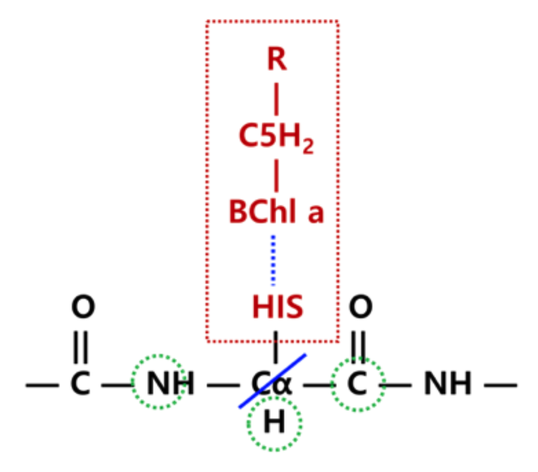

.. _applied_efp:

*********************************************
QM/EFP calculations using BioEFP and FlexEFP
*********************************************

Introduction
============

QM/EFP methods are powerful tools for describing photo- and redox-chemistry in condensed phases,
see e.g., :ref:`bio_papers`. However, setting up QM/EFP calculations for complex systems is
not trivial and time-consuming. This tutorial presents a computational workflow that helps
interested users to setup QM/EFP calculations of photoactive proteins in the format suitable for
calculations in Q-Chem. It is assumed that the initial structures for QM/EFP calculations are obtained
from a Gromacs MD trajectory. GAMESS is used for computing EFP parameters.

The workflow was tested on several photosynthetic pigment-protein
complexes (FMO, PS 1, WSCP).
While the workflow is reasonably general and can be adapted to other biological and materials systems,
the QM/EFP calculations are nowhere "black-box" and the user will need to make some decisions based on the system
specifics and the properties of interest.

Preliminaries
=============

* Gromacs installation
* GAMESS installation
* Q-Chem installation
* Python 3

To start with, you will need the following Gromacs files:

* structure file (.g96)
* topology file (.top)
* binary file from molecular dynamics (.tpr)

If you wish to use the FlexEFP scheme as described in `Flexible EFP paper
<https://pubs.acs.org/doi/abs/10.1021/acs.jpcb.6b04166>`_, you also need
a library of precomputed EFP potentials. Parameter database from `Flexible EFP paper
<https://pubs.acs.org/doi/abs/10.1021/acs.jpcb.6b04166>`_ can be found
`here <https://github.com/libefp2/EFP_parameters/tree/main/AA_flexible_efp>`_.

Workflow overview
=================

.. image:: ../images/flowchart.png
   :width: 500
   :align: center

The workflow leads the user through the following steps:

* :ref:`setup_QM_EFP`
* :ref:`fragmentation`
* :ref:`parameter_making`
* :ref:`trim_params`
* :ref:`qchem_input`

FMO protein
===========

The Fenna-Matthews-Olson (FMO) protein is used as an example system.
Preparation of the QM anf EFP regions follows the work by
`Kim et al <https://pubs.acs.org/doi/full/10.1021/acs.jpclett.9b03486>`_.

FMO is a trimeric protein with eight bacteriochloropyll a (BChl) pigments in each monomer.
FMO completes energy transfer via excitonic couplings across these eight BChls.

.. image:: ../images/FMO_trimer_BCLs.bmp
   :width: 350
   :align: center

.. image:: ../images/FMO_mon.bmp
   :width: 400
   :align: center

In the present example, water molecules more than 15 angstroms from the protein's surface have been removed.

.. image:: ../images/fmo_waters15a.bmp
   :width: 400
   :align: center

Molecular dynamics and constrained QM/MM geometry optimizations have been already performed
on the system. The constrained QM/MM geometry optimizations have been shown to be essential for accurate predictions of
optical spectra and redox properties.[REFS] However, this step is not considered in this tutorial and it is up to the user
to take care of it if needed.

.. note:: The provided .g96 file contains `QSL` and `LA` residues, corresponding to so called "quantum" waters, i.e., water
  molecules that could be included in the QM regions for QM/MM optimizations and link atoms for defining QM-MM boundaries, that
  are 'left-overs' of the QM/MM optimizations. These residues are of course not mandatory for any of the scripts below.

.. _setup_QM_EFP:

Defining QM and EFP regions
===========================

In the present example, the QM/EFP calculation will be set up for the third BChl (residue number 361) in the active (QM) region.

.. _efp_region:

EFP region
----------

While it is possible to include all non-QM atoms in the EFP region, this approach might be expansive for larger proteins,
both at the step of computing EFP parameters, and performing QM/EFP calculation. Thus, a practical approach is to
define the EFP region that will include all residues within a particular distance from the QM region.
Here, we will include every amino acid, (non-QM) BChls, and water molecules containing an
atom within 15 Angstroms of the BChl chlorin ring.

.. note:: One can extract a single snapshot from GROMACS MD trajectory in .g96 format using
  ``gmx traj -f md_50.trr -s md_50.tpr -o snapshot_timestep.g96``  [JACK]

.. note:: Note that extracting larger systems can occasionally cause columns to be misaligned
  due to the residue ID number passing from 9999 to 10000.
  This misalignment can make the structure appear strangely in VMD or other visualizers
  (i.e., you will see "sheets" of waters with coordinates
  read incorrectly). Though it shouldn't matter, you can fix the problem by realigning the columns.
  `Column reformatting script <../examples/flex-EFP/Scripts/format.py>`_ is an example of a
  script that can fix this problem.

In order to figure out which amino acids, cofactors, and water molecules constitute the EFP region,
we make use of the ``gmx select`` command, but this will take a bit of footwork. First, we create an index file
that defines the BChl `headring` group that will contain atoms of chlorin ring.

.. note:: The BChl chlorin ring (`headring`) is defined by the following atom names:
  ``MG CHA CHB HB CHC HC CHD HD NA C1A C2A H2A C3A H3A
  C4A CMA HMA1 HMA2 HMA3 NB C1B C2B C3B C4B CMB HMB1 HMB2 HMB3 CAB OBB CBB HBB1 HBB2 HBB3 NC C1C
  C2C H2C C3C H3C C4C CMC HMC1 HMC2 HMC3 CAC HAC1 HAC2 CBC HBC1 HBC2 HBC3 ND C1D C2D C3D C4D CMD
  HMD1 HMD2 HMD3 CAD OBD CBD HBD CGD O1D O2D CED HED1 HED2 HED3``

The code below will generate this index file with the default
name ``index.ndx``; index.ndx contains all standard GROMACS index groups (system, protein, etc),
with a new added group, 'headring'.

.. literalinclude:: ../examples/flex-EFP/Scripts/gen_efp_index.sh
   :linenos:

.. warning:: Make sure to adjust the code above to your system's active region!

Here is a visualization of the atoms contained in the newly created index group:

.. image:: ../images/361_headring.bmp
   :width: 400
   :align: center

We want the EFP region to be composed of all residues that contain at least one atom within
15 Angstroms of the `headring` atoms. The following command will do the job:

``gmx select -s md_80.tpr -n index.ndx -f bchl361-79002.g96 -select
'same residue as within 1.5 of group "Headring"' -on shell_index.ndx``  [JACK]

This command looks for any atom within the 1.5 cutoff (GROMACS units are nm),
then accepts every atom belonging to
the same residue as the found atom, and adds these to the selection.
The output of the command is named `shell_index.ndx`, which, as the
extension implies, is another index file. This file has exactly one index group that defines the EFP region.

Now, ``gmx editconf -f formed_bchl361-79002.g96 -n shell_index.ndx -o shell_bchl361-79002.g96``
creates a new structure file of the EFP region only.
Note that you do not need to specify the group output because the `shell_index.ndx` file only contains one group.
The headring surrounded by the EFP region looks like this:

.. image:: ../images/tester.bmp
   :width: 400
   :align: center

.. note:: The QM region will include the entire BChl, but the EFP region is defined by a distance to the chlorin ring only.

QM region
---------

.. warning:: Defining the QM region is system-specific. The user needs to prepare a text file containing all atoms of the QM region
  as well as pairs of atoms defining the covalent boundaries between the QM and EFP regions!

Take a look at the example prepared for the 3rd BChl in FMO  :download:`qm_defined.inp <../examples/flex-EFP/Scripts/qm_defined.txt>`).
This file can be constructed by
copying the corresponding lines from the `.g96` file. The "QM_atoms" section of the file should contain all QM atoms
(not including capping hydrogens for covalent QM-EFP boundaries).

.. literalinclude:: ../examples/flex-EFP/Scripts/qm_defined.txt
   :linenos:
   :lines: 1-20
   :append: ...
   :emphasize-lines: 1

The "QM-MM" boundary section is optional and should
contain pairs of atoms for each covalent boundary, with the QM atom listed first.
The example :download:`qm_defined.inp <../examples/flex-EFP/Scripts/qm_defined.txt>` contains only one QM-MM boundary, but a
second boundary could be included like this:

.. literalinclude:: ../examples/flex-EFP/Scripts/new_sample.txt
  :linenos:
  :lines: 1-
  :emphasize-lines: 1

[JACK: do coordinates need to match?]

.. _qm_region_bchl:

Example: QM region for the third BChl in FMO
~~~~~~~~~~~~~~~~~~~~~~~~~~~~~~~~~~~~~~~~~~~~

By trial and error we found that including the Mg-coordinating amino acid residue in the QM region
in QM/EFP calculations helps
SCF convergence and makes excitation energies more reliable.
Thus,  the QM region will include all atoms of the BChl (residue BCL 361) as well as atoms from the nearby
histidine that coordinates the BChl Mg atom shown below.

.. image:: ../images/qm_region.bmp
   :width: 400
   :align: center

This shows the entire residue 361 (BCL) and 290 (HIS), however, we only want to include the side chain of this histidine.
In other words, the residue atoms including :math:`C_{\beta}` should be included in the QM region, and the
backbone atoms (starting with :math:`C_{\alpha}`) should remain in the EFP region. That division looks like this:

.. image:: ../images/qm_w_cut.bmp
   :width: 400
   :align: center

Thus, we create a covalent QM-EFP boundary between :math:`C_{\beta}` and :math:`C_{\alpha}`, reflected in the example above.
The scripts will automatically cap the QM region with hydrogen atoms positioned between the boundary atoms,
so the QM region in the QM/EFP calculations will look like this:

.. image:: ../images/qm_capped.bmp
   :width: 400
   :align: center

We will discuss preparation of the EFP fragment for the boundary histidine later on.

.. _fragmentation:

Fragmentation of the EFP region
===============================

Now we need to prepare EFP fragments for our system. In :ref:`efp_region` we have already created `.g96` file containing atoms
belonging to the EFP region. Here we will split polypeptide chains and other large residues into EFP fragments.

.. _protein_efp:

Splitting protein into EFP fragments
------------------------------------

Because protein is a continuous chain, covalent bonds between neighboring amino acids have to be broken.
Chemically, we would like to break the :math:`C-C_{\alpha}` bond
(between alpha carbon and carbonyl carbon), however, standard PDB convention divides residues by the C-N bond (alpha carbon-nitrogen).

PDB residues are divided like this:

.. image:: ../images/pdb_67_col.bmp
   :width: 400
   :align: center

EFP fragments need to be divided like this:

.. image:: ../images/efp_67_col.bmp
   :width: 400
   :align: center

This, EFP amino acid fragments will not completely 'agree' with the PDB amino
acid numbering. Below is a snippet from the structure file (.g96) with the EFP fragment 7 highlighted. Note that atoms
'C' and 'O' of the PDB residue 6 (SER) will be included in the EFP fragment 7 (ASP).

.. literalinclude:: ../examples/flex-EFP/1.Prepare_Structure/bchl361-79002.g96
   :linenos:
   :lines: 79-101
   :emphasize-lines: 10-21

A daunting task of splitting the protein into EFP fragments is accomplished by script ``make_AAs.py``.
A sample execution is:

``python make_AAs.py shell_bchl361-79002.g96 bchl361-79002.g96 qm_defined.txt topol.top``

The input parameters are:
* `.g96` file containing atoms of EFP region (see :ref:`efp_region`)
* `.g96` file containing a full system (your initial structure from MD)
* user-prepared file with definition of QM region and QM-EFP boundaries
* `*.top` topology file for your system

Output:
* GAMESS MAKEFP input files for all amino acids and other residues

.. note:: GAMESS MAKEFP input file parameters might be adjusted in ``make_AAs.py``

The script splits the EFP region of the protein into EFP fragments and creates a GAMESS MAKEFP input file for each fragment.
The script will create EFP fragments and corresponding input files for non-amino acid residues.

The filenames use information from `*.g96` file;
for example, v_22_301.inp is a valine residue (v), residue number 22, and the first atom of this fragment has an atom
ID of 301. [JACK: based on which g96?] Histidine residues are denoted hd\_, he, or hp\_ depending on protonation states.
Capping hydrogens are added automatically to amino acid fragments, with atom names H000. The capping hydrogens will be
automatically removed from the amino acid EFP fragments once the EFP parameters are computed.

Non-standard amino acids are named with full residue names given in the g96 structure file
(i.e., bcl_360_5667.inp for the BCL with residue number 360).
Non amino acids fragments are created with no capping hydrogens by default.

.. _qmefp_boundary_fragments:

QM-EFP boundary fragments
-------------------------

For a fragment with a QM-EFP covalent boundary (e.g., HIS 290 from :ref:`qm_region_bchl`),
the script will add two comment lines to the end of the input file.
The ``!comment atoms to be erased`` line will contain atom names of the QM atoms to be removed from the
parameter file. `!polarization points to remove` will additionally list atoms around which polarization points
will be removed. These atoms are found as the covalently bound to the "to-be-deleted atoms" by analysis of
the topology file.
Here is an example for HIS 290 (hd_290_4417.inp):

.. literalinclude:: ../examples/flex-EFP/1.Prepare_Structure/hd_290_4417.inp
   :linenos:
   :emphasize-lines: 31,32

Note that while CA (alpha-carbon) is not a part of the QM region, it is a QM-EFP boundary atoms and will be also removed from the
parameter file in a later step. The commented lines will be used later to finalize the fragment parameter files.
Here we follow a QM-EFP boundary scheme developed by Yongbin Kim `FMO paper <https://pubs.acs.org/doi/full/10.1021/acs.jpclett.9b03486>`_
that ensured stability of QM/EFP calculations in the FMO protein.

.. warning: The developed scheme for QM-EFP boundaries in amino acid fragments is general. However,
  the user might need to modify it for non-standard fragments.

If a residue contains only QM atoms, such as BCL 361 in our example, no input file
will be created.

Non-amino acids and cofactors
-----------------------------

``make_AAs.py`` is robust in preparing EFP fragments for amino acid sequences and non-covalently linked molecules (e.g.,
water molecules, ions, simple cofactors). However, large cofactors (exceeding 100 atoms) and non-protein polymers
need to be further split into EFP fragments. Making a general script that would solve this task is work
in progress. Here we provide a script that splits (B)Chl `a` into chlorin head and tail
fragments.

.. note:: ``make_AAs.py`` creates fragments for all non-amino acid residues including (B)Chls. However,
  it creates one fragment for the entire residue. If you plan to create sub-fragments as explained below,
  you should delete the full molecule input files made with ``make_AA.py``.

Below is the division of the head and tail groups in BChl:

.. image:: ../images/efp_headtail.bmp
   :width: 400
   :align: center

The script ``make_bchls.py`` creates two fragment input files for each Bchl molecule according to that division. Capping
hydrogens are added where the two are normally covalently bound, much like the case for the amino acid backbone bonds. The
script can be executed by:

``python make_bchls.py shell_bchl361-79002.g96 361``

[JACK: wrong arguments here?]

This script is "hard-coded" for the FMO BChls. You can try to edit it for your purposes.
Variable "RESNAME" is the name of the residue to be fragmented. The list "Headrings" includes the atom
names for every atom to be added to the head fragment. Atoms that are not in this list will
be added to the tail fragment. Variables "headside" and "tailside" are the names
of the two atoms that are normally covalently bound, but will be capped for the fragmentation.
Variable "site" is optional, it lists the residue ID of a QM residue that doesn't need to be fragmented
because it is in the QM region.

.. _parameter_making:

EFP parameter generation
========================

``make_AAs.py`` and ``make_bchls.py`` from the previous step created a collection of GAMESS MAKEFP input files.
Now you have two options:

* compute all needed EFP parameters by running the MAKEFP inputs in GAMESS
* use FlexEFP procedure to obtain parameters by rotation of the already computed
  parameters stored in the database

If you system is small and/or you do not want to use FlexEFP scheme, submit GAMESS calculations
for all generated inputs, make sure to collect all produced ``.efp`` files and proceed
to the next section :ref:`clasical_fragment`.

Otherwise, ``fragment_RMSD.py`` script will check geometry of a fragment against
fragments available in the database of pre-computed parameters (for amino acids, the script is smart to search only
among the same-amino acid fragments).
If the RMSD between the two structures is sufficiently small, then the parameters are
considered good enough and will be adjusted (rotated and translated to exactly match geometry
of your fragment), such that you don't have to calculate them in GAMESS!

.. note:: A path to the EFP parameter database is hard-coded in ``fragment_RMSD.py`` script.
  Adjust it accordingly!

.. note:: The RMSD threshold value is hardcoded in ``fragment_RMSD.py`` to 0.2 Angstroms. Change
  it if desired.

The script `fragment_RMSD.py` can be run by the following example:

``fragment_RMSD.py a_4_45.inp``

This reads the given GAMESS MAKEFP input file (a_4_45.inp) and computes the RMSD with each .efp file it can find in the ``ala/``
directory of the database ("a" in the input name is a one-letter name of alanine).

[JACK: is t=it relevant? "then name the final folder(s) by amino acid (ie, ala/, cys/, thr/, etc)"]
[JACK: need to move step4.Flexible_V5.py to the directory with these scripts]

If no suitable match is found in the database, the script will print a message of "No match, run GAMESS for: <filename>",
and an .efp file will not be created.
If no database folder is found, or if the input is not a standard,
non-terminal amino acid, the python script will return an error.
For all such fragments, you will need to run GAMESS calculations. Fortunately, most of them
will not take more than a few minutes.

[JACK: need to make this part easier to use. e.g., create a list of all non-computed fragments or copy those inputs into
separate directory]

[JACK: If you need to repeat this step, delete this text file to avoid confusion. - which text file?]

A simple way to use this script for all fragments in the EFP region is to make a bash script to iterate through every ``*.inp``
file in the current directory.

.. _clasical_fragment:

The Classical Region Fragment
-----------------------------

Atoms not included in either QM or EFP regions, i.e., atoms far from the QM subsystem, will be included
in the QM/EFP calculation as classical atoms possessing only partial charges. We will combine all these classical
atoms into a single EFP "superfragment" that will contain only coordinates, monopoles and screen sections.

``make_mm.py`` reads the EFP region structure, the full
structure, and the topology to create this "superfragment" efp file.

``python make_MM.py shell_bchl361-79002.g96 bchl361-79002.g96 topol.top``

The topology file is necessary for atomic charges, and both structure files are read so that only MM atoms will be
included (both QM and EFP atoms are omitted).

.. _trim_params:

EFP parameter trimming
======================

Before using the QM/EFP calculations, EFP fragment parameters need to be trimmed. That is,

* capping hydrogens that were added to amino acid fragments to make them closed-shell molecules for parameter
  calculations need to be removed. All parameters associated with capping hydrogens need to be removed as well.
* fragments with QM-EFP covalent boundaries need to be cleaned from all QM atoms and boundary atoms. Additionally,
  some of polarization points at the boundary need to be eliminated to avoid overpolarization of the QM region.
* [JACK: what about BChls? which script takes care of those?]

[JACK: cut_qm.py name is misleading]

``cut_qm.py`` script trims EFP parameters following the (optional) information provided in the MAKEFP input files.

.. note:: ``cut_qm.py`` will always delete hydrogens named H000 (capping hydrogens added to cap dangling bonds when
  fragments were cut from a larger molecule) and the associated parameters.

QM-EFP boundary fragments will be treated based on the information provided in comment sections in the input files,
see :ref:`qmefp_boundary_fragments`

A sample execution is:

``cut_qm.py hd_290_4417.inp hd_290_4417.efp``

[JACK: what is this paragraph? Does not match with the example: "ala_33_473.inp is an alanine fragment with
QM atoms commented to be deleted and EFP atoms to have polarization
points removed. a0001.efp is a parameter file that is either the output of the input file, or translated
information from a database parameter file to align with the input's coordinates."]

``cu_qm.py`` must be executed on every amino acid and other fragmented residues.

.. _qchem_input:

QM/EFP input generation
=======================

Now that all fragment ``.efp`` files are prepared, the QM/EFP input in Q-Chem format can be created.
[JACK: change to make_final_qchem.py]
``make_final.py`` will take care of this step. Sample execution looks like:

``make_final.py shell_bchl361-79002.g96 bchl361-79002.g96 qm_defined.txt``

Function "build_header" contains the keywords for the Q-Chem calculation; these can be adjusted as needed. When you submit
the calculation, .efp parameter files will need to be in the same folder as the input file.

[JACK: to do: make similar function for GAMESS QM/EFP calc. Check fragnames...]

Time-Saving Tips
================

In the case of FMO, the normal procedure is to repeat the EFP calculation for eight different BChl pigments. Fragments
can be reused between calculations if they come from the same snapshot. I.e., bchl360-79002.g96 will need a handful of new
fragments than those created already for bchl361-79002.g96, but the majority of EFP fragments are already made. This can save
a lot of time in repeated calculations.

Another suggestion is creating your own library of EFP fragments and using it for FlexEFP step.
Often, the library created for one protein will work very well for related proteins.
