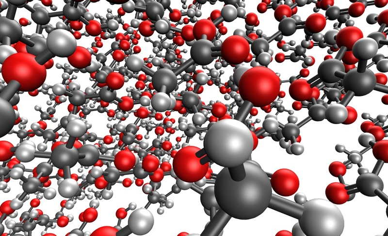
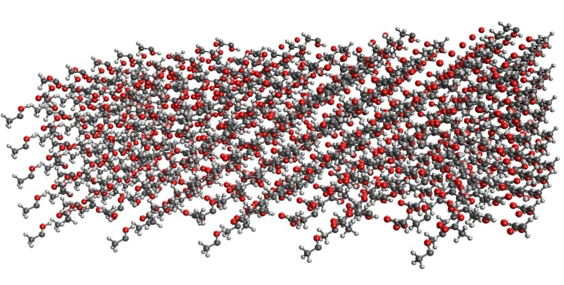

.. _drug_design_images:

************
Drug-design
************

Small organic crystals
----------------------

Predicting the stability of molecular crystals remains a formidable challenge in the natural sciences. 
We perform pairwise EFP calculations on crystal lattices in a periodic box, with the aim of developing 
a computationally tractable scheme involving EFP and quantum mechanical methods like SAPT to aid crystal 
structure predictions. 

Acetic Acid Clusters
~~~~~~~~~~~~~~~~~~~~

